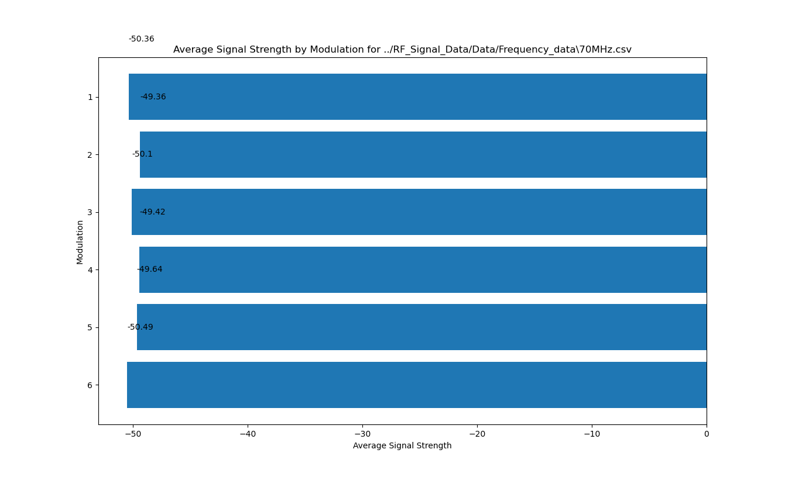
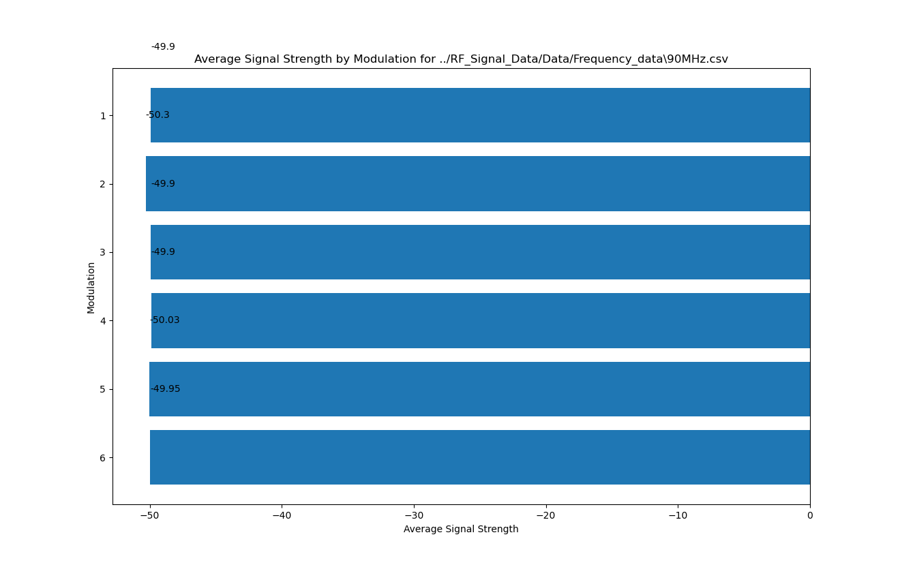
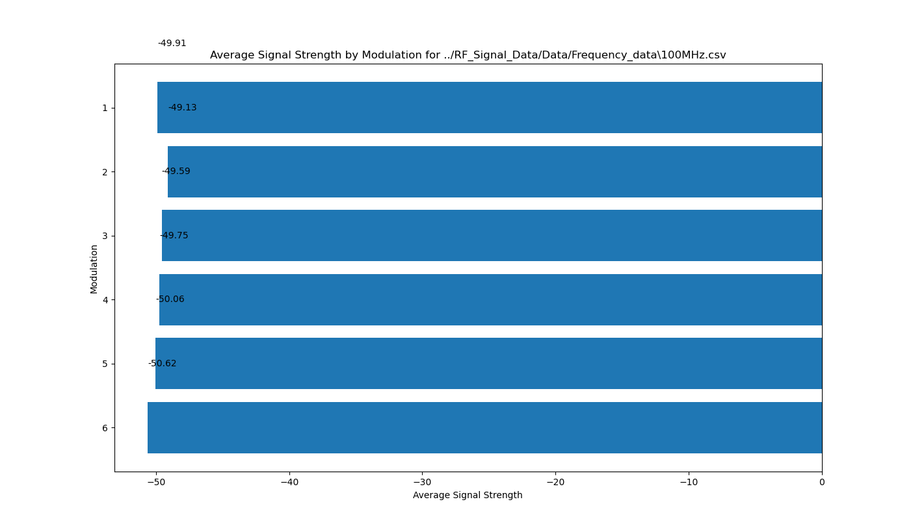
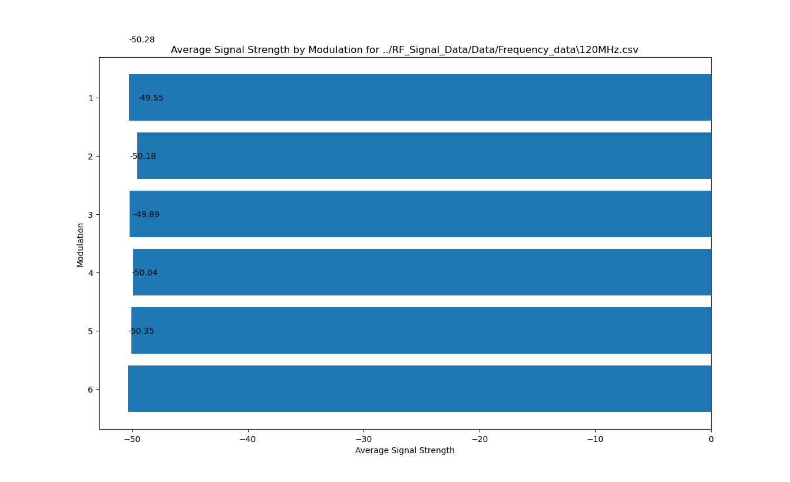
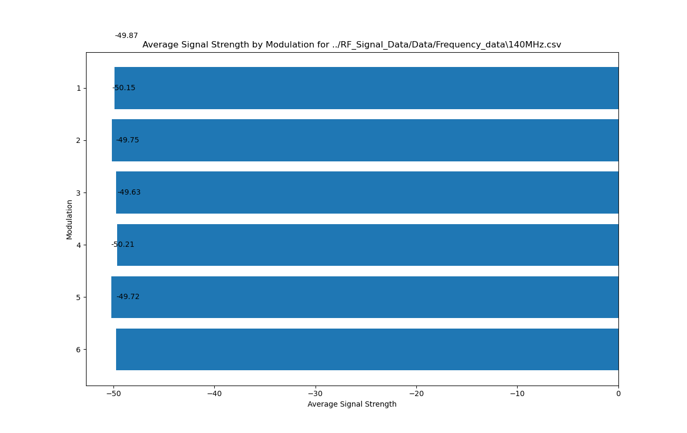
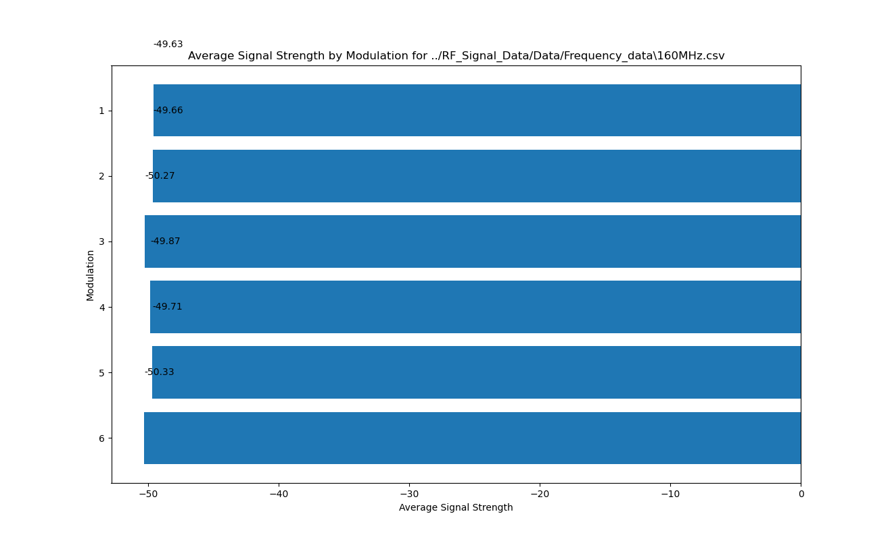

# RF Data Processing

This Python script is designed to process RF data by performing various operations on a given data file. The script utilizes the `RFDataProcessing` class, which provides methods for data description, column mapping, data transformation, and analysis.

## Table of Contents
1. Overview
2. Question
3. Cleaning
4. Requirements
5. Usage
6. Visualization
7. Conclusion
8. Data Source
9. License
10. File Structure

## 1. Overview
Signal theory is a fundamental concept in the field of electrical engineering and communication systems. It deals with the study and analysis of signals, which are representations of information or data that vary with time, space, or any other independent variable. 

Signal: A signal is a time-varying quantity that carries information. It can be analog or digital in nature. Examples of signals include audio signals, video signals, sensor readings, and communication signals.

Bandwidth: The range of frequencies required to transmit a signal or the capacity of a communication channel to carry information. Bandwidth is measured in Hertz(Hz)

Modulation: The process of modifying a carrier signal to encode information for transmission.

In-phase and Quadrature (I/Q): A method used in signal processing and modulation techniques to represent and manipulate complex signals.

Time Domain and Frequency Domain: Signals can be analyzed in the time domain or the frequency domain. In the time domain, the signal is represented as a function of time. In the frequency domain, the signal is represented as a combination of sinusoidal components with different frequencies.

Amplitude: The amplitude of a signal represents the strength or magnitude of the signal at any given time. It is usually measured in volts for analog signals or digital levels for digital signals.

Frequency: The frequency of a signal refers to the number of cycles or oscillations the signal completes in one second. It is measured in Hertz (Hz). High-frequency signals have more cycles per second and appear as rapid changes, while low-frequency signals have fewer cycles and appear as slow changes.

Signal theory forms the basis for various applications, including telecommunications, audio and video processing, image and speech recognition, radar systems, medical imaging, and many other fields where information is transmitted, analyzed, and processed using signals.

This dataset being analyzed here is a collection of Signal Related Information (SRI), data/ metadata of a signal rather than the infromation being transmitted by the signal. 

This was produced by the data owner transmitting I/Q data and receiving signals at set Frequencies, Bandwidths, and Modulation types with 4 different types of antennas.
   - Yagi: a type of directional antenna consisting of two or more parallel resonant antenna elements.
   - Directional: send and receive signals in one direction only, usually in a tightly focused, very narrow beam.
   - Dipole: commonly consists of two identical conductive elements such as metal wires or rods.
   - Omnidirectional: radiates equal radio power in all directions.

Typically the more directional an antenna gets, the better it is able to send and receive a signal

## 2. Question

According to the dataset, does the weather, antenna type, and/ or modulation type have an effect on the strength of the signal at the receiver.

## 3. Data cleaning

For the above question there are few applicable columns of data from the overall set. These are:
   - Frequency
   - Signal Strength
   - Modulation
   - Antenna Type
   - Weather Condition

For cleaning the data I started by removing columns that were immediately not applicable to the proposed question. I dropped these columns from the dataframe for a few reasons. In some cases the value did not change such as location, longitude, latitude, altitude, battery level, power source. Additionally if not already removed I removed columns that would have no bearing on signal strength such as CPU usage, memory usage, system load and more. Lastly I decided to drop the I/Q data column as although potentially applicable there is too much variance to account for in the given amount of time. 

The data was otherwise very thorough and complete without any missing data.


## 4. Requirements

- Python 3.x
- pandas library
- matplotlib library

## 5. Usage

1. Install the required dependencies by running the following command:

   ```shell
   pip install pandas matplotlib
   ```

2. Place the RF data file (`logged_data.csv`) in the `RF_Signal_Data/Data` directory.

3. Run the script using the following command:

   ```shell
   python src/RF_Data_Processing.py [-h] [-d] [-m] [-a] [-dc] [-f] [-c] [-p] [-all] data_file
   ```

4. The script accepts the following optional arguments:

   - `-h`, `--help`: Show help information for the available arguments.
   - `-d`, `--data-description`: Print data description.
   - `-m`, `--create-maps`: Create column maps.
   - `-a`, `--apply-maps`: Apply column maps.
   - `-dc`, `--drop-columns`: Drop columns.
   - `-f`, `--frequency-parser`: Parse frequencies and save to CSV files.
   - `-c`, `--correlation-analysis`: Perform correlation analysis.
   - `-p`, `--plot-graphs`: Plot graphs.
   - `-all`, `--all-functions`: Run all functions.

5. The script will execute the selected operations in the specified order.

6. The processed data and analysis results will be displayed in the console output.

## 6. Visualizations







## 7. Conclusion
- The script function 'analyze_correlation' which creates a correlation matrix based on the columns of the dataframe shows that there is no strong correlation between any of the columns and this is supported by the above graphs. I arbitrarily chose the cutoff for determining correlation to the abosolute value of r being greater than or equal to .5
   - There is a false positive when correlating mapped values but due to time constraints I was unable to effectively handle this.


- Some of the columns analyzed together make sense to not be correlative i.e. battery level and frequency

- There are however some suprising finds from what wasn't correlative.
   - Weather Conditions had no significant bearing on signal strength
      - In signal theory it is quite reasonable to expect rainy weather to create an impact on signal quality
   - Antenna Type had no significant bearing on signal strength
      - This leads me to believe that the emitters and receivers were located very close to one another

- Finally, without knowing how much power was used to generate these signals it is hard to draw any more conclusions from the data. With the framing of the question asking about signal strength there is not much further exploration we can do without having this piece of data
   - I did reach out to the data owner requesting this infromation, as well as more infromation but as of 12JUL23 I have not received a response.


## 8. Data Source
 - https://www.kaggle.com/datasets/suraj520/rf-signal-data

## 9. License

This project is free to use.

## 10. File Structure

```
RF_Data
└─ RF_Signal_Data
   ├─ Data
   │  ├─ Frequency_data
   │  │  ├─ 100MHz.csv
   │  │  ├─ 120MHz.csv
   │  │  ├─ 140MHz.csv
   │  │  ├─ 160MHz.csv
   │  │  ├─ 70MHz.csv
   │  │  └─ 90MHz.csv
   │  ├─ logged_data.csv
   │  └─ Modulation_data
   │     ├─ 1.csv
   │     ├─ 2.csv
   │     ├─ 3.csv
   │     ├─ 4.csv
   │     ├─ 5.csv
   │     └─ 6.csv
   ├─ notebooks
   │  └─ rf_signal_data.ipynb
   ├─ README.md
   └─ src
      └─ RF_Data_Processing.py
```